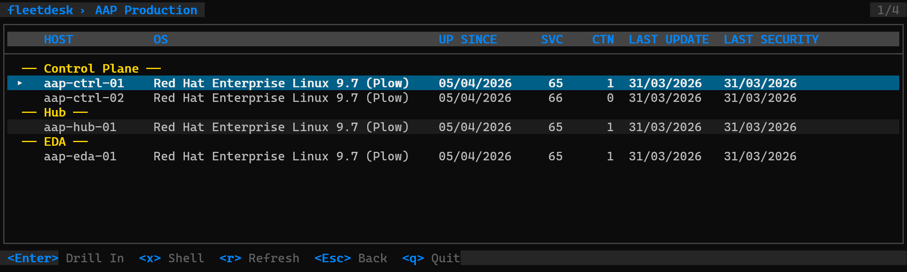
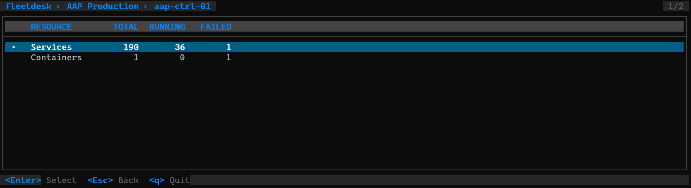
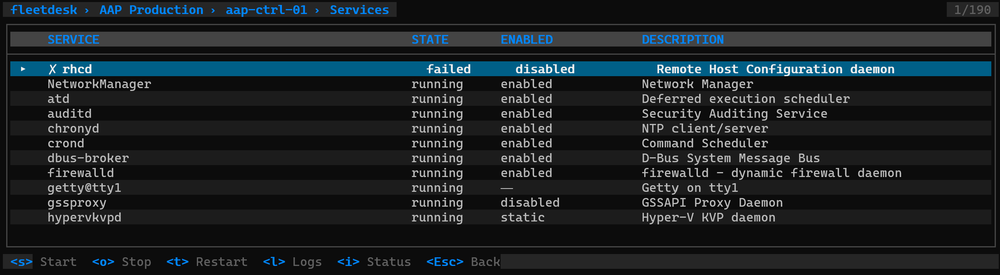
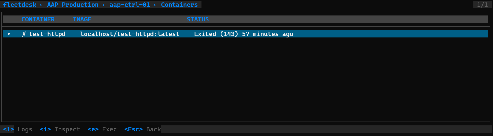

# FleetDesk

[](https://github.com/Gaetan-Jaminon/fleetdesk/actions/workflows/ci.yml)
[](https://github.com/Gaetan-Jaminon/fleetdesk/actions/workflows/claude-review.yml)
[](https://github.com/Gaetan-Jaminon/fleetdesk/releases)
[](go.mod)
[](LICENSE)

Fleet management TUI — manage Linux VMs over SSH with k9s-style navigation.

## Overview

`fleetdesk` is a terminal UI application that provides a unified view of your Linux VM fleet.
Connect via SSH, browse systemd services and Podman containers, and manage them interactively.

No agents, no server — just a single binary that reads a host list and connects via SSH.

## Screenshots

### Fleet Picker


### Host List


### Resource Picker


### Service List


### Container List


## Features

- k9s-style navigation: Fleet → Host → Services/Containers
- Systemd service management: start, stop, restart, logs, status (with sudo)
- Podman container inspection: logs, inspect, exec
- Parallel SSH connections with async status updates
- Host groups with visual separators
- Service filter patterns (per-fleet, per-group, per-host)
- Password fallback prompt when key auth fails
- SSH shell into any host (`x` key)
- Terminal handover for interactive commands
- Fleet configuration via YAML files
- Sort by state: failed first, then running, then inactive

## Install

```bash
go install github.com/Gaetan-Jaminon/fleetdesk@latest
```

Or download a binary from [Releases](https://github.com/Gaetan-Jaminon/fleetdesk/releases).

## Configuration

Fleet files live in `~/.config/fleetdesk/`:

```yaml
name: AAP Production

defaults:
  user: ansible
  timeout: 10s
  systemd_mode: system

groups:
  - name: Control Plane
    hosts:
      - name: aap-ctrl-01
        hostname: aap-ctrl-01.example.com
      - name: aap-ctrl-02
        hostname: aap-ctrl-02.example.com

  - name: Hub
    hosts:
      - name: aap-hub-01
        hostname: aap-hub-01.example.com

hosts:
  - name: monitoring-01
    hostname: monitoring-01.example.com
```

### Service Filtering

Filter services using glob patterns at any level (defaults, group, or host):

```yaml
defaults:
  service_filter:
    - "automation-*"
    - "postgresql*"
    - "redis*"
```

## Key Bindings

### Fleet Picker

- `Enter` — select fleet
- `e` — edit fleet file
- `r` — reload config
- `q` — quit

### Host List

- `Enter` — drill into host
- `x` — SSH shell
- `r` — refresh
- `Esc` — back

### Service List

- `s` — start
- `o` — stop
- `t` — restart
- `l` — logs (journalctl -f)
- `i` — status detail
- `Esc` — back

### Container List

- `l` — logs
- `i` — inspect
- `e` — exec shell
- `Esc` — back

## SSH Authentication

FleetDesk relies on your existing SSH setup:

1. SSH agent
2. `~/.ssh/config` (IdentityFile, User, Port, ProxyJump)
3. Default keys (~/.ssh/id_ed25519, id_rsa, id_ecdsa)
4. Password fallback (inline masked prompt)

## License

MIT
