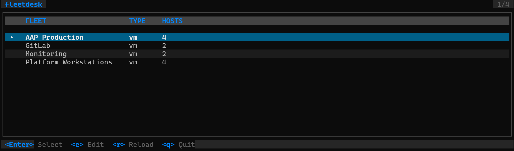

# FleetDesk

[](https://github.com/Gaetan-Jaminon/fleetdesk/actions/workflows/ci.yml)
[](https://github.com/Gaetan-Jaminon/fleetdesk/actions/workflows/claude-review.yml)
[](https://github.com/Gaetan-Jaminon/fleetdesk/releases)
[](go.mod)
[](LICENSE)

Manage your entire platform infrastructure from a single TUI.
VMs, Azure subscriptions, Kubernetes clusters — one tool, one view.

## Why FleetDesk?

Platform teams juggle SSH terminals, Azure portal, kubectl contexts, and monitoring dashboards across dozens of targets. Context-switching kills productivity.

FleetDesk gives you a unified k9s-style interface to manage them all:

- **No agents, no server** — single static binary, zero infrastructure
- **No credentials to manage** — uses your existing SSH keys, `az` CLI, `kubectl` contexts
- **No learning curve** — navigate with arrow keys, filter with `/`, sort with `1-N`
- **Multi-platform** — manage VMs, Azure subscriptions, and Kubernetes clusters from the same tool

Think Cockpit, but as a TUI. Think k9s, but for everything — not just Kubernetes.

## Screenshot



## What You Can Manage

### VM Fleets (via SSH)

| Resource | What it shows |
|----------|--------------|
| Services | systemd units — start, stop, restart, logs, status |
| Containers | Podman — logs, inspect, exec shell |
| Cron Jobs | user crontab + /etc/cron.d |
| System Logs | journalctl by severity, structured detail view |
| Updates | dnf check-update, apply all or security-only |
| Disk | filesystem usage with threshold alerts |
| Subscription | RHEL registration, repo health |
| Accounts | local + IPA/IDM users, sudo detection |
| Network | interfaces, ports, routes, firewall (auto-detect) |
| Failed Logins | SSH login attempts |
| Sudo Activity | who ran what as whom |
| SELinux Denials | AVC denials |
| Audit Summary | aureport authentication events |
| Metrics Dashboard | fleet-wide CPU/MEM/DISK/Load per host |

### Azure Subscriptions (coming soon)

Resource groups, VMs, costs — via local `az` CLI.

### Kubernetes Clusters (coming soon)

Pods, deployments, services, nodes — via local `kubectl`.

## Quick Start

### Install

```bash
go install github.com/Gaetan-Jaminon/fleetdesk@latest
```

Or download a binary from [Releases](https://github.com/Gaetan-Jaminon/fleetdesk/releases).

### Configure

Create a fleet file in `~/.config/fleetdesk/`:

```yaml
# VM fleet
name: My Platform
type: vm

defaults:
  user: ansible
  timeout: 10s

groups:
  - name: Web Servers
    hosts:
      - name: web-01
        hostname: web-01.example.com
      - name: web-02
        hostname: web-02.example.com

  - name: Databases
    hosts:
      - name: db-01
        hostname: db-01.example.com
```

```yaml
# Azure fleet (coming soon)
name: Azure Production
type: azure

groups:
  - name: APP-PRD
  - name: MANAGEMENT
```

```yaml
# Kubernetes fleet (coming soon)
name: AKS Production
type: kubernetes

groups:
  - name: aks-app-prd-blue
  - name: aks-app-prd-green
```

### Run

```bash
fleetdesk
```

Debug mode (logs to `~/.local/share/fleetdesk/debug.log`):

```bash
fleetdesk --debug
```

## Navigation

```
Fleet Picker --> Host List --> Resource Picker --> View
     |               |
     |               +--> Metrics Dashboard (d)
     |
     +--> Azure / K8s (coming soon)
```

| Key | Action |
|-----|--------|
| `Up/Down` or `K/J` | Navigate |
| `Enter` | Select / Detail |
| `Esc` | Back |
| `/` | Filter / Search |
| `1-N` | Sort by column |
| `r` | Refresh |
| `d` | Metrics dashboard (from Host List) |
| `x` | SSH shell (from Host List) |
| `q` | Quit |

## SSH Authentication

FleetDesk uses your existing SSH setup — no additional configuration needed:

1. SSH agent
2. `~/.ssh/config` (IdentityFile, User, Port, ProxyJump)
3. Default keys (~/.ssh/id_ed25519, id_rsa, id_ecdsa)
4. Password fallback (inline masked prompt)

## License

MIT
